<div align="center">


</div>

<div align="center">

```bash
mohmmadjavad@github:~$ whoami
> Full Stack Developer
mohmmadjavad@github:~$ echo $STATUS
> Building things that work, breaking things to learn 🖤
```

</div>

<p align="center">
  
</p>

<p align="center">
  
</p>

<p align="center">
  <sub>🖥️ نسخه‌ی کاملاً تعاملی توی فایل <code>preview.html</code> هست — بازش کن توی مرورگر:<br/>
  بوت‌آپ BIOS واقعی، ترمینال زنده (تایپ کن <code>help</code>)، دکمه‌ی Power روشن/خاموش، دسته‌ی کانال برای عوض‌کردن رنگ فسفر (سبز/کهربایی/آبی)، افکت VHS با REC چشمک‌زن، و یه ایسترِگ مخفی: توی ترمینال بنویس <code>matrix</code> 🐇🕳️</sub>
</p>

<p align="center">
  
</p>

---

### 💻 تخصص‌های من

<div align="center">

| 🗂️ حوزه | ⚙️ تکنولوژی‌ها |
| :---: | :--- |
| **Backend** |     |
| **Frontend** |     |
| **Database** |    |
| **Tools** |     |
| **Design** | -000000?style=flat-square&logo=adobephotoshop&logoColor=00ff41)  |

</div>

---

### 📌 پروژه‌های برتر

```diff
+ [آذین دژ]      پلتفرم پیشرفته درب و پنجره UPVC با SVG configurator
+ [فروشگاه لباس]  E-commerce با AR virtual try-on و چت‌بات هوشمند
+ [ربات کالا ۲]   اسکرپ دیوار و ارسال قیمت از طریق تلگرام
```

---

### 📊 GitHub Stats

<div align="center">


</div>

<!--
🐍 برای فعال‌سازی مار متحرک روی گرافِ کانتریبیوشن‌ها:
یک ورک‌فلو گیت‌هاب اکشن به اسم snake.yml اضافه شده (توی .github/workflows).
فقط کافیه در تنظیمات ریپازیتوری بخش Actions رو فعال کنی و اکشن اجرا بشه؛
بعدش می‌تونی این خط رو از حالت کامنت خارج کنی:


-->

---

### 🔗 ارتباط با من

<p align="center">
  <a href="https://t.me/immdjavad"></a>
  <a href="https://instagram.com/immdjavad"></a>
  <a href="https://linkedin.com/in/immdjavad"></a>
  <a href="mailto:Mohmmadjavad.mahmoodi@gmail.com"></a>
</p>

---

### 📫 چطور به من برسید؟

- **Telegram:** [@immdjavad](https://t.me/immdjavad)
- **Email:** Mohmmadjavad.mahmoodi@gmail.com

<p align="center">
  
</p>

<div align="center">
  
</div>
